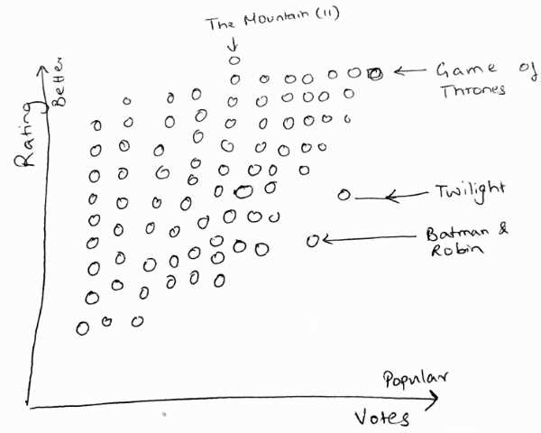

---
title: Render the design
prefix: learn-g1-templates
...

We will use what we learned about [templates](../learn-g1-templates/) to render this design:



This tutorial will explain how to:

[TOC]

## Load the data

The data is in [movies.json](movies.json) -- a 1MB JSON file. It's an array with each row as a title.

```js
[
  {"id":"tt0000417","n":"A Trip to the Moon","y":"1902", ...},
  {"id":"tt0000439","n":"The Great Train Robbery","y":"1903", ...},
  // ... etc
]
```

Each row / movie has these fields:

- `id`: Unique ID on IMDb. The URL is `https://www.imdb.com/title/<id>`
- `n`: Name of the title
- `y`: Year of release
- `g`: Genres, comma separated (e.g. `"Action,Crime,Short"`)
- `t`: Type of the title (e.g. `movie`, `short`, `tvseries`, `tvepisode`, etc)
- `r`: Rating as a weighted average of individual user ratings
- `v`: Number of votes

Let's load the data and render the number of movies in our dataset.

<!-- render:html -->
```html
<script type="text/html">
  We have data for <%= data.length %> titles.
</script>
<script>
$.getJSON('movies.json')
  .done(function (data) {
    $('body').template({data: data})
  })
</script>
```

[View source](load-data.html){: class="source"}

## Draw a box for each movie

Let's plot the movies in an 800 x 600 SVG element. Each movie will be a circle. Higher rated movies are on top (lower `y`). Popular movies are on the right (higher `x`).

By trial and error, I arrived at this formula:

- `x = 250 * Math.log10(votes / 10000)`
- `y = 600 * (1 - rating/10)`

This lets us draw each movie at the correct location.

<!-- render:html -->
```html
<script type="text/html">
  <svg width="800" height="600" class="w-100">
    <% _.each(data, function (title) { %>
      <circle
        cx="<%= 250 * Math.log10(title.v / 10000) %>"
        cy="<%= 600 * (1 - title.r / 10) %>"
        r="5"
        fill="rgba(0,0,0,0.1)">
          <title><%- title.n %></title>
    </circle>
    <% }) %>
  </svg>
</script>
```

[View source](draw-movies.html){: class="source"}

-----------

[Next: Add filters for preferences &raquo;](../interactive-filters/){: class="btn btn-lg btn-success my-4"}


<script src="../../tutorial.js"></script>
