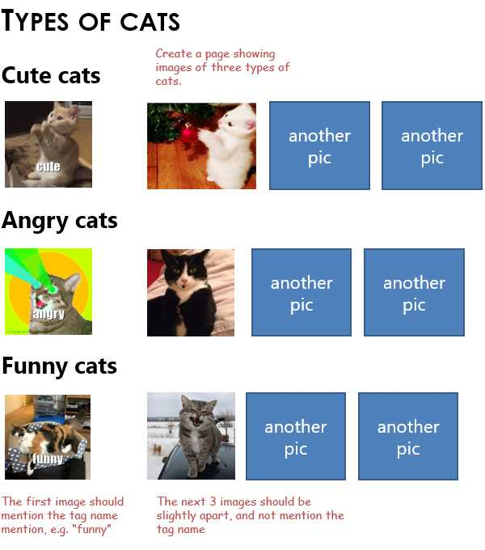

---
title: Learn g1 templates
prefix: learn-g1-templates
...

We will use [g1](../../g1/) as the main templating library. It wraps the [lodash template library](https://lodash.com/docs/#template) with some useful features.

You can write HTML or SVG inside a `<template>...</template>` or `<script type="text/html">...</script>` tag. When you call `$('body').template()`, it renders them, using these rules:

- By default, all text is rendered as-is.
- Anything inside `<%= ... %>` is evaluated as JavaScript and is displayed
- Anything inside `<% ... %>` is evaluated as JavaScript, and not displayed

This means that you don't need to learn anything new. If you know HTML and JavaScript, you already know how to use these templates.

This tutorial will explain how to:

[TOC]

## Load libraries

Create an `index.html` file and import these dependencies.

- [jQuery](https://www.jsdelivr.com/package/npm/jQuery) for DOM manipulation (required by g1)
- [lodash](https://www.jsdelivr.com/package/npm/lodash) for data crunching (required by g1)
- [g1](https://www.jsdelivr.com/package/npm/g1) for templating. **Note**: `g1` should be loaded *after* jQuery and lodash.

Add this to `index.html`. It doesn't change the output. It just adds libraries.

```html
<script src="https://cdn.jsdelivr.net/npm/jquery"></script>
<script src="https://cdn.jsdelivr.net/npm/lodash"></script>
<script src="https://cdn.jsdelivr.net/npm/g1"></script>
```

[View source](load-libraries.html){: class="source"}

## Render a template

Add this to your `index.html`. It renders the squares of numbers from 1 to 5.

<!-- render:html -->
```html
<script type="text/html" class="tmpl">
  <% for (var n=1; n<=5; n++) { %>
    <div><%= n %> &times; <%= n %> = <%= n * n %></div>
  <% } %>
</script>
<script type="text/html">This won't be rendered -- no class="tmpl"</script>
<script>
  $('.tmpl').template()
</script>
```

[View source](render-template.html){: class="source"}

**Note**: We prefer `<script type="text/html">` over `<template>`. `<template>` requires valid HTML. Templates like `<input <%= required %>>` are **not** valid HTML, and **won't** work inside `<template>`.

**Note**: You can also call `$('body').html()` to render all `<script type="text/html">` or `<template>` tags under `<body>`.

## Pass data from JavaScript

You can pass data to `.template(...)` as an object. For example:

<!-- render:html -->
```html
<script type="text/html" class="data-js">
  x = <%= x %>,                 <!-- "x" must be passed to this template -->
  y = <%= JSON.stringify(y) %>  <!-- "y" must also be passed -->
</script>
<script>
  $('.data-js').template({
    x: 1,           // The template can use the variable "x"
    y: ["a", "b"]   // The template can use the variable "y"
  })
</script>
```

[View source](pass-data-from-js.html){: class="source"}

## Pass data from HTML

You can pass data to templates via `data-*` attributes. These can be accessed in the templates as the `$data` object.

You can pass data to templates via any other attribute too. These can be accessed as `$node.attr('...')`.

For example:

<!-- render:html -->
```html
<script type="text/html" class="data-html" data-x="1" data-y="['a', 'b']">
  data-x = <%= $data.x %>,
  data-y = <%= JSON.stringify($data.y) %>,
  class = <%= $node.attr('class') %>,
  type = <%= $node.attr('type') %>
</script>
<script>
  $('.data-html').template()
</script>
```

[View source](pass-data-from-html.html){: class="source"}

The `data-*` attributes are parsed as JSON if they begin with `[` or `{`.

## Load external templates

You don't need to create the template in the same file. Add a `src="template.html"` to load the template from an external HTML file. (This uses [AJAX](https://developer.mozilla.org/en-US/docs/Web/Guide/AJAX), so use the same server or enable [CORS](https://developer.mozilla.org/en-US/docs/Web/HTTP/CORS).)

<!-- render:html -->
```html
<script type="text/html" class="external" src="subtemplate.html"></script>
<script>
  $('.external').template()
</script>
```

[View source](load-external.html){: class="source"}


## Re-use by appending

Normally, calling `$(...).template()` multiple times **overwrites** the output.

But if you add `data-append="true"` to the template, it appends to the output.

For example, this calls the template 3 times. The output repeats 3 times.

<!-- render:html -->
```html
<script type="text/html" class="append" data-append="true">
  <div><%= n %> x <%= n %> = <%= n * n %></div>
</script>
<script>
  $('.append').template({ n: 1 })
  $('.append').template({ n: 5 })
  $('.append').template({ n: 10 })
</script>
```

[View source](reuse-append.html){: class="source"}

You can also pass an options object with `{append: true}` instead of `data-append="true"`. For example `$('.append').template({}, {append: true})`.

## Render into a target

Normally, `$(...).template()` renders the template **in-place**.

But if you add `data-target="selector"` to the template, it renders inside the target selector.

For example, this renders the template inside a `<div class="target">` node.

<!-- render:html -->
```html
<script type="text/html" class="target" data-target="div.target" data-append="true">
  This text from the template is rendered inside the target element, though it was written above it.
</script>
<p>This text is written below the template, but will appear first.</p>
<div class="target">This is the target element. </div>
<script>
  $('script.target').template()
</script>
```

[View source](render-target.html){: class="source"}

**Note**: we used [data-append="true"](#re-use-by-appending) to *append* to the target. If we didn't use it, the target contents will be *replaced*.

You can also pass an options object with `{target: 'selector'}` instead of `data-target="selector"`. For example `$('script.target').template({}, {target: 'div.target'})`.

## Re-use as sub-templates

You can use templates inside other templates.

- Add the `data-template-mytemplate=".sub-template"` attribute to your template
- Use `<%= mytemplate() %>` inside your template
- This renders the template with `class="sub-template"`

For example:

<!-- render:html -->
```html
<script type="text/html" class="sub-template" data-target="false">
  <li><a href="<%= val %>"><%= val %></a> -- from sub-template</li>
</script>
<script type="text/html" class="main-template" data-template-list=".sub-template">
  <ul class="mb-0">
    <%= list({ val: 'abc' }) %>
    <%= list({ val: 'def' }) %>
    <%= list({ val: 'xyz' }) %>
  </ul>
</script>
<script>
  $('.main-template').template()
</script>
```

[View source](reuse-subtemplate.html){: class="source"}

These sub-templates can also be [external templates](#load-external-templates). This helps create a library of re-usable sub-templates.

You can use as many `data-template-*` attributes as you need. One template can re-use multiple sub-templates.

**Note**: Add a `data-target="false"` to sub-templates to avoid rendering them in-place.

## Animate templates

Normally, `$(...).template()` removes the output and re-creates it.

But if you add a `data-engine="vdom"` to the template, it minimally changes the nodes and attributes that have really changed. For example, if you just changed the color, the node remains the same, and just the `color=` attribute changes.

This uses a [virtual DOM library called morphdom](https://github.com/patrick-steele-idem/morphdom). You need to include it in your script using:

```html
<script src="https://cdn.jsdelivr.net/npm/morphdom/dist/morphdom-umd.min.js"></script>
```

In the example below, we have an SVG circle. We change its position every 1 second. Normally, it would be re-drawn. But `data-engine="vdom"` just changes the x and y attributes. CSS transitions make the movement smooth.

<!-- render:html -->
```html
<script src="https://cdn.jsdelivr.net/npm/morphdom/dist/morphdom-umd.min.js"></script>
<style>
  circle { transition: all 1s ease; }
</style>
<script type="text/html" data-engine="vdom" class="bouncing-ball">
  <svg width="500" height="50">
    <circle cx="<%= x %>" cy="<%= y %>" r="5" fill="red"></circle>
  </svg>
</script>
<script>
  // Update the template every 1 second to animate
  setInterval(function() {
    $('.bouncing-ball').template({
      x: Math.random() * 500,
      y: Math.random() * 50
    })
  }, 1000)
</script>
```

[View source](animate-vdom.html){: class="source"}

## Wait until rendered

Once the template is rendered, it triggers a `template` event. This may not be immediate -- the template needs to load [external sources](#load-external-templates) or [subtemplates](#re-use-as-sub-templates).

This code changes the template after it is rendered.

<!-- render:html -->
```html
<script type="text/html" class="events">
  <div>
    <i class="text-danger">This text is originally red.</i>
    It will turn green 2 seconds after it is rendered.
  </div>
</script>
<script>
  $('.events')
    .on('template', function (e) {
      setTimeout(function () {
        $(e.target).find('i').toggleClass('text-danger text-success')
      }, 2000)
    }).template()
</script>
```

[View source](events.html){: class="source"}

## Exercises

### Multiplication table

A primary school teacher needs a beautiful multiplication table printed, multiplying all numbers from 1 to 10. Create a printable version using JS templates.

### Types of cats

Create a template that shows different types of cats. The output should look like this:

<a class="d-block img-fluid" href="cats.jpg" target="_blank"></a>

Ensure that you use templates for each row of cats. You should be able to:

- Change "cute" to "sad" by making a single change
- Change the text on the first picture by making a change in a single place
- Change the number of pictures for any row (independent of other rows) by changing in a single place

You can get the pictures dynamically from [cataas.com](https://cataas.com/).


-----------

[Next: Render the design &raquo;](../imdb-template/){: class="btn btn-lg btn-success my-4"}

<script src="../../tutorial.js"></script>
